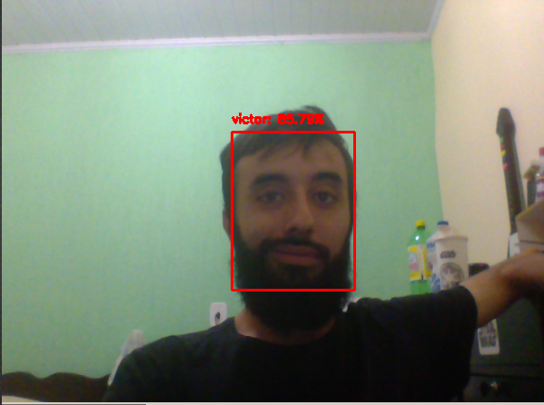

# Almighty-Eye
A facial recognition system.  The system is capable of recognizing faces in a live video stream, and to identify pre-trained  faces.
	

## Setting up environment with Anaconda
	1. Install ['Anaconda'](https://docs.conda.io/en/latest/) to do this.
	2. Create `Almighty-eye` environment.
	3. run `pip install -r requirements.txt` to install the necessary libraries
	4. Activate you virtual environment `conda activate almighty-eye`
	
## Create a dataset directory
	1. Inside the `sys/` directory, create a `dataset/` folder.
	2. In the `dataset/` directory create folders with the name of the person to be identified
	
	
## Run program
	1. Run in the terminal with the virtual environment activate: `python3 main.py`
	2. In the camera open, press `q` to exit program
	
	
## Training a new model model
	1. Create a folder inside dataset with the name of the person.
	2. Put pictures of her face inside the folder.
	3.Run `model.py` file to training the model.
	4. Run `main.py` to start the recognition
	
##References
	1. Tutorial in image search engines in ['PyImageSearch'](https://www.pyimagesearch.com/).
	2. System for Face verification:
		 see: ['FaceNet: A Unified Embeddings for Face Recognition and Clustering'](https://www.cv-foundation.org/openaccess/content_cvpr_2015/app/1A_089.pdf)
	2. The database used to train the Not Recognized persons:
	see: ['allfaces'](https://cswww.essex.ac.uk/mv/allfaces/index.html)

	

	
	

